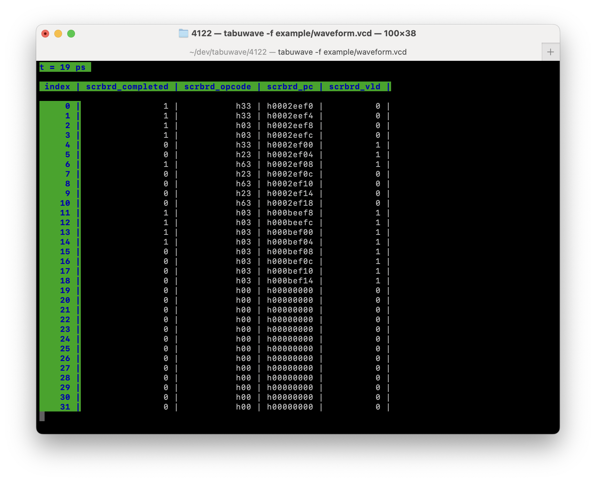
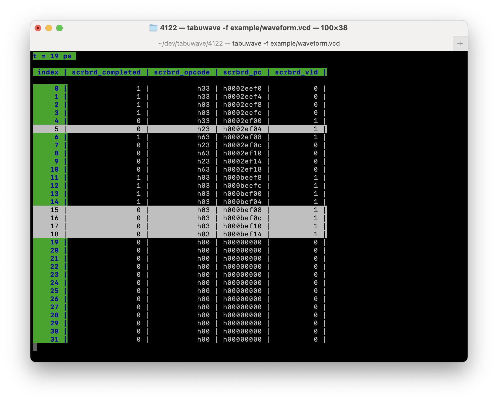

# tabuwave

Tabular waveform viewer as a simple terminal user interface. Instead of using the traditional signal-to-time dimensions, Tabuwave uses an index-to-signal dimension at a specific time to make it easier to compare the same bit/groups of bits across multibit signals, such as a scoreboard or buffer of entries represented as masks or arrays. Currently only supports VCD files as input.

# Compilation

## General compilation

[Install Boost libraries](https://www.boost.org/doc/libs/1_83_0/more/getting_started/index.html) and [change the path to Boost in the Makefile](Makefile#L17) or specify the `BOOST_DIR` when compiling with `make` if needed.
```
make BOOST_DIR=<your boost path>
```

To use OpenMP, add `USE_OMP=1` to your `make` command:
```
make BOOST_DIR=<your boost path> USE_OMP=1
```
If `USE_OMP` is not defined, `std::thread` is used for multithreading by default.

## PACE-ICE instructions

The Makefile has been designed to work on my local machine and the PACE-ICE cluster (for ECE 4122). To compile and run on PACE-ICE:
```
module load boost

make            # to use std::thread multithreading
make USE_OMP=1  # to use OpenMP

./tabuwave -f example/waveform.vcd 
```
NOTE: The `ncurses` dynamic library on PACE-ICE causes a segfault when `newpad` is called, so the TUI is essentially unusable there. However, you can still run on PACE-ICE to see the parse times and value interval processing times.

# Usage

Run with (for example):
```
./tabuwave -f example/waveform.vcd 
```
See help text with `-h`

When run, Tabuwave will perform parsing and preprocessing and report the processing times and VCD file metadata on the first screen. Press `ENTER` to move onto signal selection menu screen.

## Commands when navigating menu
| Command       | Description             |
| -----------   | --------------------    |
| `DOWN_ARROW` or `j`           | move cursor down in menu          |
| `UP_ARROW` or `k`           | move cursor up in menu      |
| `SPACE`           | expand/collapse scope in menu      |
| `s`           | select/unselect signal to view in table      |
| `C`           | unselect all      |
| `ENTER`           | go to table with selected signals      |
| `Q`           | quit (exit program)      |


## Commands when viewing table
| Command       | Description             |
| -----------   | --------------------    |
| `:<#> + ENTER`         | jump to time `<#>`      |
| `LEFT_ARROW` or `h`          | next timestamp     |
| `RIGHT_ARROW` or `l`          | previous timestamp      |
| `/<#> + ENTER`        | jump to line at index `<#>`      |
| `DOWN_ARROW` or `k`           | jump to next line          |
| `UP_ARROW` or `j`           | jump to previous line      |
| `?<query_str> + ENTER`           | highlight all rows satisfying the conditions in `<query_str>`. `<query_str>` is formatted like a URL query string, but it can also specify multiple values for a signal with an or. For example: `?scrbrd_vld=1&scrbrd_opcode=h03\|h23` to query for all rows/indices where `scrbrd_vld` is 1 and `scrbrd_opcode` is either `h03` or `h23`. `&` can only be used between different signals, and `\|` can only be used for different values within the same signal     |
| `t`           | toggle table with/without horizontal lines      |
| `Q`           | quit (return to menu)      |

# Example

When would you use a tabular waveform viewer? 

Suppose you have designed a simple processor, and an assertion for your design related to verifying LSU behavior failed at t=19ps. You have a scoreboard-type data structure to keep track of instructions which is represented as arrays (`scrbrd_pc`, `scrbrd_opcode`) and masks (`scrbrd_completed`, `scrbrd_vld`), and to debug help the failure, you want to find the PCs for all the loads and stores that haven't completed yet.

In a traditional waveform viewer (GTKWave shown below), the unpacked arrays and multibit signals are laid out in vertical rows. It can be hard to visualize this data side-by-side and match the different properties at each index.


In Tabuwave, it's easy to visually find the entries you're looking for.



You can use the query `?scrbrd_vld=1&scrbrd_opcode=h03|h23&scrbrd_completed=0` to highlight the rows of interest.



This is a trivial example, but the scoreboard could be hundreds of entries long, and this type of data structure could be part of a checker used for verification or even part of the design itself, such as a load/store buffer or reorder buffer.

# Details

This is a custom project submission for ECE 4122, so below are what fulfill the grading requirements.

- Classes
    - See header files under [include](include/) for details on the `Parser` class, `TuiManager` class, and classes representing parsed nodes from a Vcd file.
- Multithreading
    - See [Parser.cpp](src/Parser.cpp)
    - Multithreading is used to process vcd data for each `VcdVar` into its own interval_map in parallel.
    - Both hand-threading with `std::thread` (distributing work as evenly as possible among the available concurrent threads supported by hardware) and multithreading using `OpenMP` are implemented and can be switched/selected during compile time. See usage instructions.
